# 项目介绍

简单的IM聊天项目

项目使用golang作为后端服务开发语言，vue作为前端框架。

项目主要有如下几个部分组成

- conn_engine 负责维护与客户端连接的fd，主要用于收发消息，和客户端通信。
- data_engine 负责提供数据服务，主要为其他服务提供数据服务（其他服务不需要关系数据的缓存，持久化等细节）
- msg_engine 负责异步处理消息数据，主要消费消息并将结果发送给客户端，异步解耦提高系统稳定性。
- user_center 负责维护用户的基本操作和信息。
- chatGPT_server 聊天机器人。
- log_transfer 负责收集解析日志数据。

# 项目架构

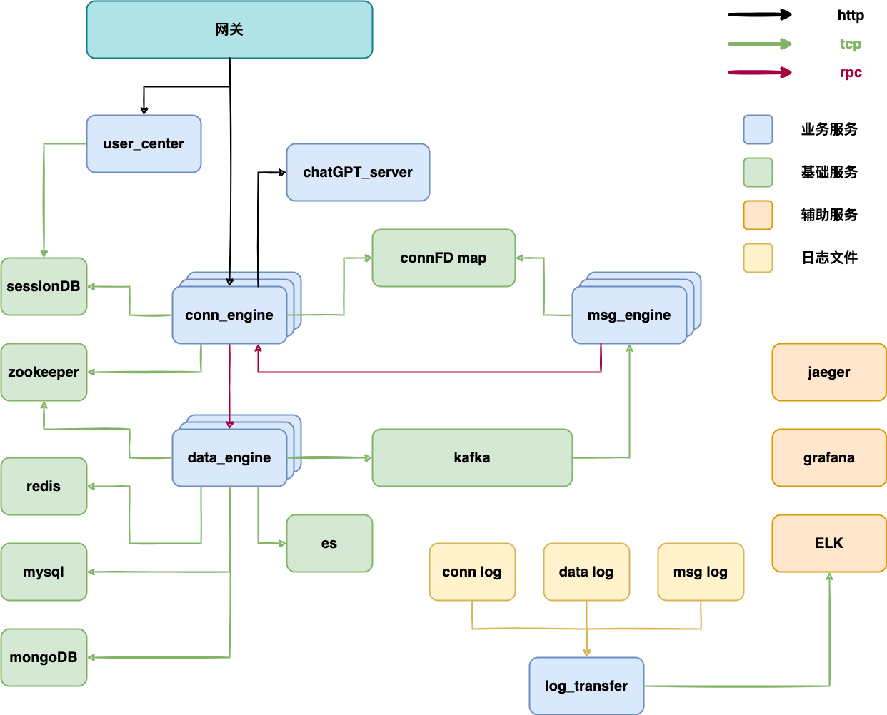

网关项目：https://github.com/donscoco/gateway_be

gochat前端：https://github.com/donscoco/gochat_fe

# 技术栈

- mysql

- redis

- mongodb

- gin

- kafka

- elasticsearch

- 阿里云oss

- zookeeper

- vue+node

  

# 功能

- [x] 注册/登陆
- [x] 修改 头像/签名 等个人信息
- [x] 添加/查询/删除 好友
- [x] 创建/解散 群组
- [x] 邀请/踢出 群组成员
- [x] 文字/表情/语音/视频 聊天
- [x] 聊天记录查询
- [x] 文件传输
- [x] chatGPT机器人聊天

stun 服务列表：https://gist.github.com/yetithefoot/7592580  

# 项目展示

线上demo：http://8.134.137.220:8880/dist     （线上机器配置和带宽都比较低，第一次加载会比较慢）

注册登陆页面

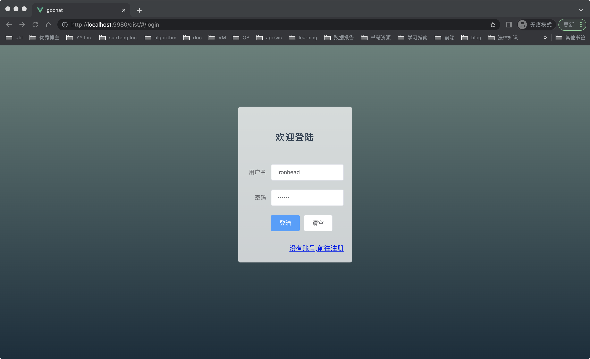

home主页

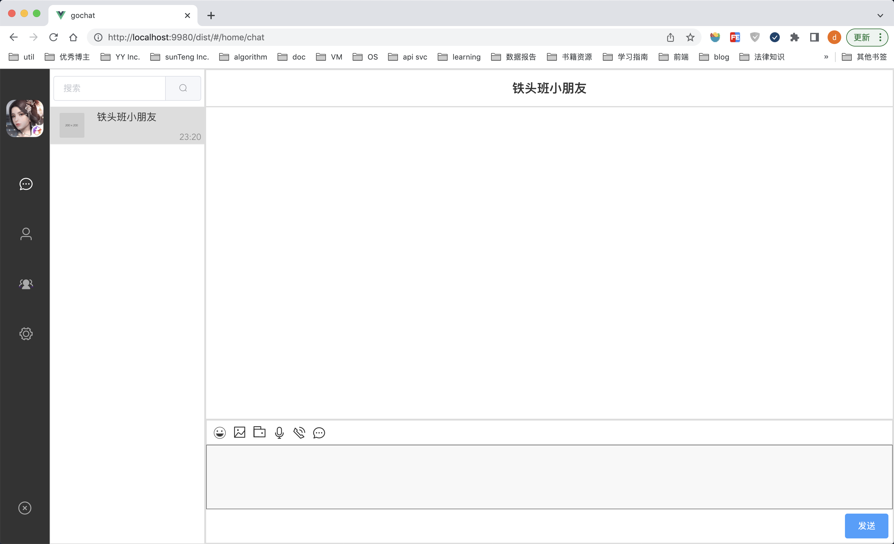

好友列表

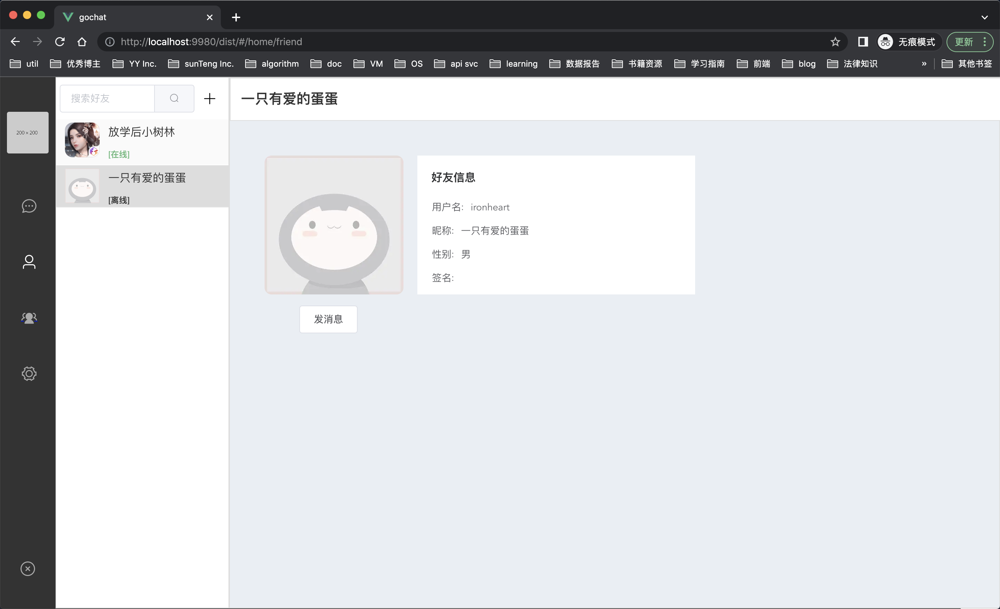

添加好友

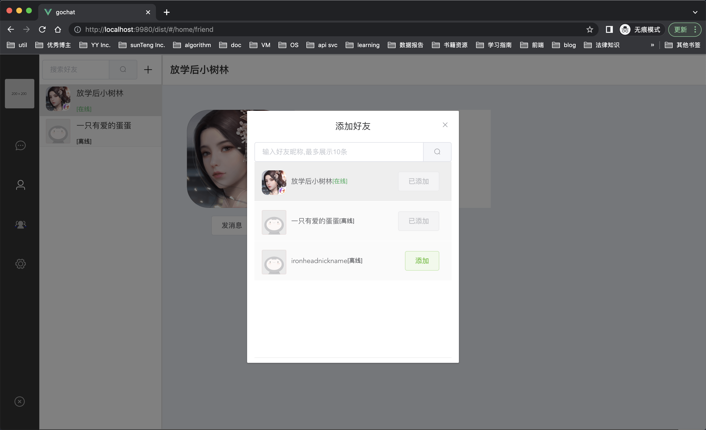

发送表情

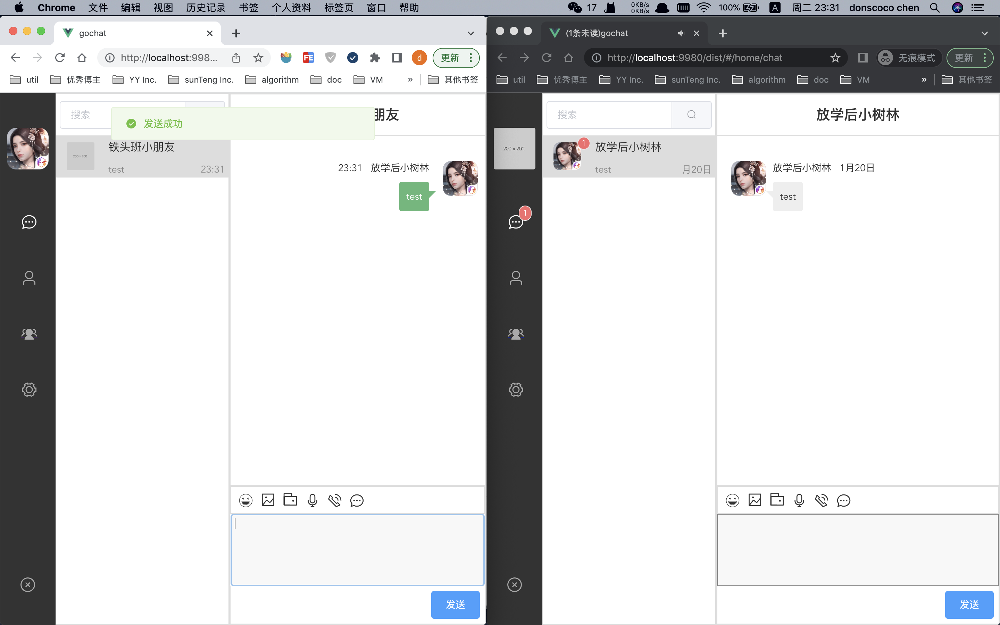

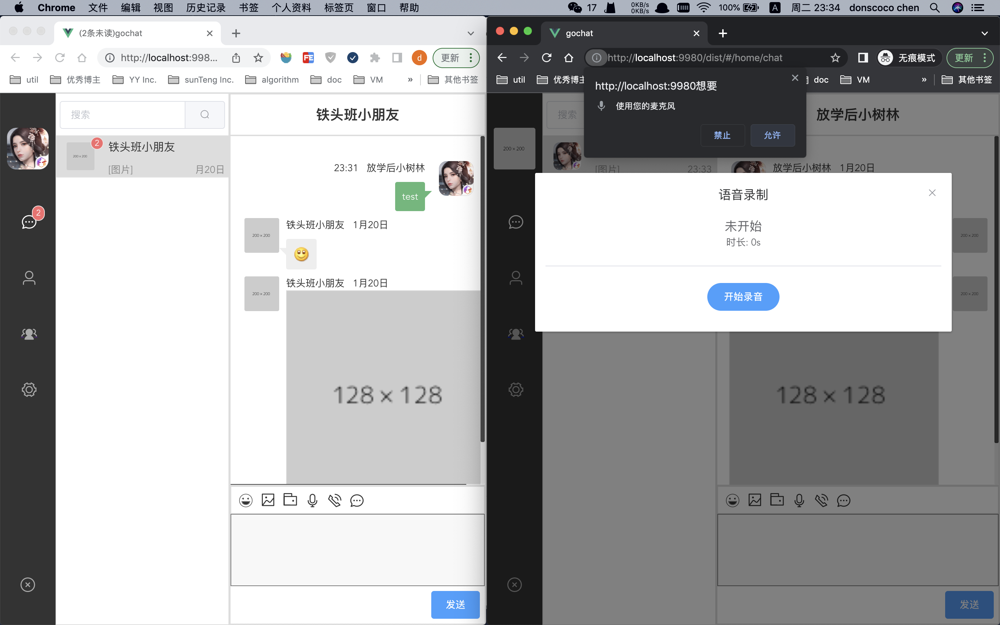

视频聊天

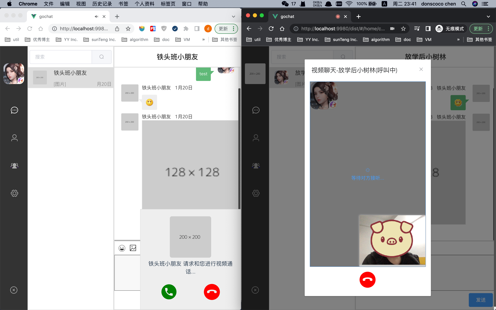

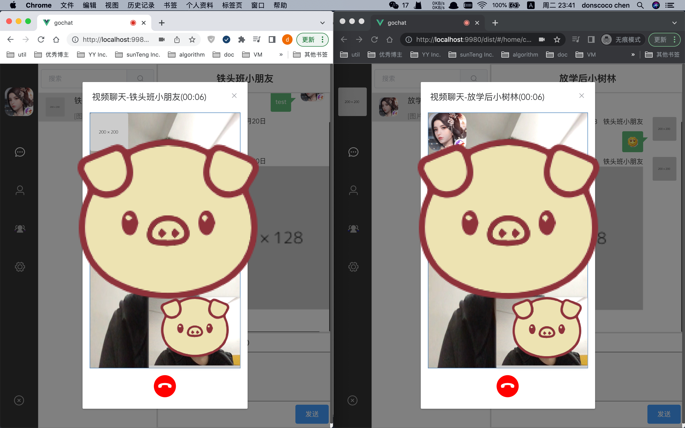

创建群组

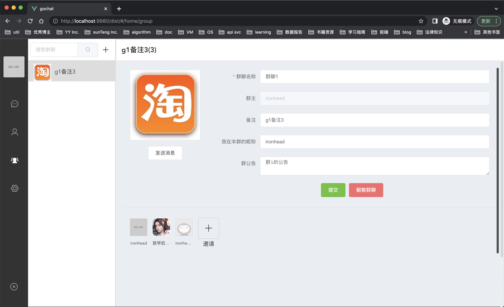

邀请好友

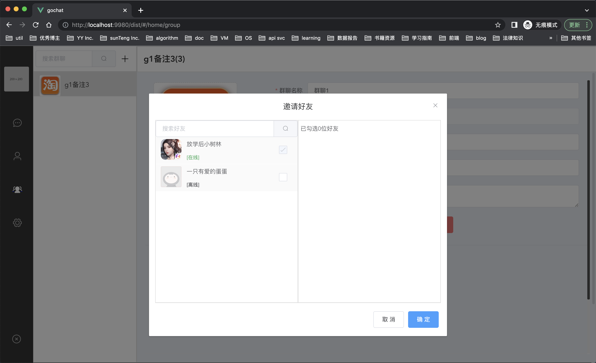

# 项目计划

- [x] chatgpt 聊天机器人

- [ ] 添加社区如朋友圈等

- [ ] 添加附近的人功能

- [ ] 添加直播和聊天室等

- [ ] 加入elasticsearch 搜索

- [ ] 消息重发ack机制

- [ ] 消息撤回，重发等

- [ ] cdn加速静态资源

- [ ] promethus+grafana监控

- [ ] jaeger 链路追踪

- [ ] 日志ELK

- [ ] 实现自己的stun server

- [ ] rpc 改成支持跨语言的 rpc 如 thrift 等。

stun 服务列表：https://gist.github.com/yetithefoot/7592580	